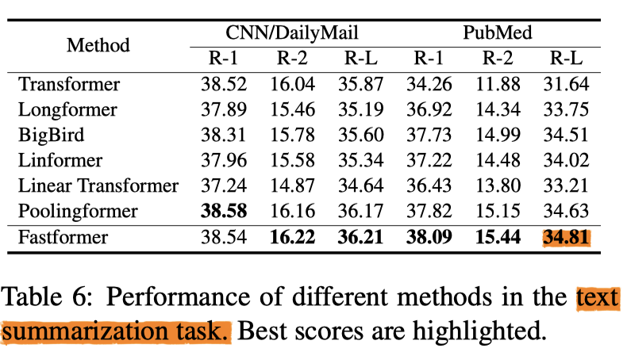

# Fast Transformer - Paddle

## TD

[paddle 复现论文参考 repo](https://github.com/PaddlePaddle/models/blob/develop/docs/ThesisReproduction_CV.md)

- [x] step1 模型结构对齐
  - [x] 模型输入对齐，生成 fake_data
  - [x] 模型初始化对齐
  - [x] 模型前向传播对齐
- [ ] step5 模型训练
  - [x] 输入数据集对齐
  - [x] 模型初始化对齐
  - [ ] 反向传播对齐

## 文件结构

```
fast-transformer-pytorch-main
├─ LICENSE
├─ README.md
├─ chkpt_initial
│    └─ chkpt_convert.py
├─ fake_data
│    └─ gen_fake_data.py
├─ fast-transformer.png
├─ pics
│    ├─ debug.png
│    ├─ image-20211024144240527.png
│    ├─ image-20211024144336758.png
│    └─ 超惨设置.png
├─ setup.py
├─ step1
│    └─ check_step1.py
├─ step5
│    ├─ amazon_pd.py
│    ├─ amazon_torch.py
│    └─ datasetloader.py
├─ test.py
├─ transformer_paddle
│    ├─ __init__.py
│    ├─ fast_transformer_pd.py
│    └─ main_pd.py
└─ transformer_pytorch
       ├─ .ipynb_checkpoints
       │    └─ fast_transformer_pytorch-checkpoint.py
       ├─ __init__.py
       ├─ fast_transformer_torch.py
       └─ main_torch.py
```

- pics 存放图片
- chkpt_initial 模型初始化对齐
- fake_data 模型输入对齐
- setup.py 依赖环境
- **step1** 模型结构对齐
- **step5** 反向传播对齐
  - datasetloader.py 加载数据集到 .npy 文件中
  - amazon_torch.py 文本分类PyTorch实现
  - amazon_paddle.py 文本分类Paddle实现
- **transformer_paddle** 
  - fast_transformer_pd.py 待转换 paddle 代码
  - main_pd.py 顶层测试用，其中路径需改动
- transformer_pytorch 
  - fast_transformer_torch.py 原 torch 代码
  - main_torch.py 顶层测试用，其中路径需改动

## 问题

###### 网络最后一层梯度对齐

- bias 不可
- weight 可以

###### 环境

- 模型参数对齐、输入数据对齐、dropout为0、参数初始化（直接导入了PyTorch中的初始化参数）

###### 差异

Torch


Paddle


## 任务

Amazon Electronic Review Rating Classification

文本分类任务， 5 分类，随机抽取 Electronics 子类中 50k 的数据集

- 40k train
- 5k eval
- 5k test

参考链接：https://github.com/wuch15/Fastformer

## debug

debug 视图

- 设置断点，看对应变量、运算过程是否相同


# 论文

实验设置


情感主题分类

- F1


文本概括

- R-L



# 原 repo

</img>

## Fast Transformer - Pytorch

Implementation of <a href="https://arxiv.org/abs/2108.09084">Fast Transformer</a> in Pytorch. This only work as an encoder.

<a href="https://www.youtube.com/watch?v=qgUegkefocg">Yannic video</a>

<a href="https://www.youtube.com/watch?v=Ich5TIvdYRE">AI Epiphany</a>

## Install

```bash
$ pip install fast-transformer-pytorch
```

## Usage

```python
import torch
from transformer_pytorch import FastTransformer

model = FastTransformer(
    num_tokens=20000,
    dim=512,
    depth=2,
    max_seq_len=4096,
    absolute_pos_emb=True
    # default uses relative positional encoding, but if that isn't working, then turn on absolute positional embedding by setting this to True
)

x = torch.randint(0, 20000, (1, 4096))
mask = torch.ones(1, 4096).bool()

logits = model(x, mask=mask)  # (1, 4096, 20000)
```

## Citations

```bibtex
@misc{wu2021fastformer,
    title   = {Fastformer: Additive Attention is All You Need}, 
    author  = {Chuhan Wu and Fangzhao Wu and Tao Qi and Yongfeng Huang},
    year    = {2021},
    eprint  = {2108.09084},
    archivePrefix = {arXiv},
    primaryClass = {cs.CL}
}
```
