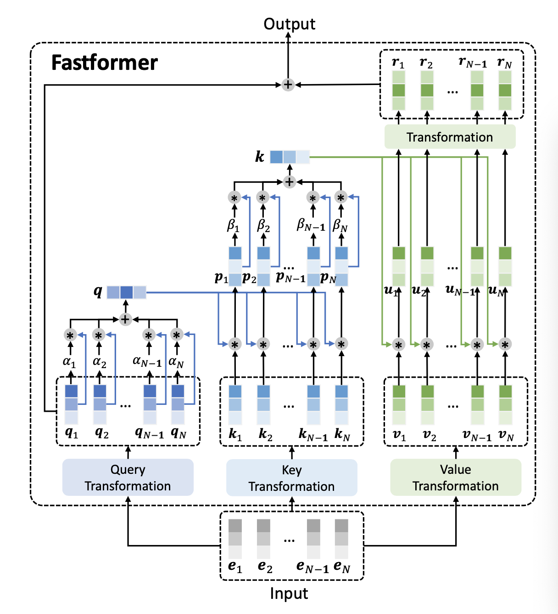

# 论文简介

## **一．背景**

Transformer 是处理文本理解的有效模型，但是由于其输入序列长度的二次复杂度，效率低下。因此在论文中提出了一个基于additive attention 的模型 Fastformer。

 

## **二．简介**

在Fastformer中，没有对标记之间的成对冲突进行建模，而是首先使用加性注意机制对全局上下文进行建模，然后根据每个标记表示与全局上下文表示的交互作用对其进行转换。

 

## **三．适用方向**

自然语言处理，文本理解。

 

## **四．相关论文研究**

由于由于自我注意计算输入表示在每一对位置之间的点积，其复杂度是输入序列长度的二次次方，因此标准Transformer模型很难有效地处理长输入序列

关于加速 Transformer 模型的相关研究：

BigBird computes sparse attention instead of a dense one:

它结合了局部关注、特定位置的全局关注和特定数量token之间的随机关注，但是稀疏的关注通常不能完全模拟全部环境。

Linformer the low-rank characteristic of the self-attention matrix : 

它将注意力键和价值投射到与序列长度无关的低维矩阵中。但是这种近似实际上是与上下文无关的，这可能会削弱Transformer的上下文建模能力。而且这两种方法对于很长的输入仍然不够高效。

 

# 数据集介绍

该数据集包含来自Amazon的产品评论和元数据，包括从1996年5月到2014年7月的1.428亿评论。

这个数据集包括评论(评级、文本、帮助投票)、产品元数据(描述、类别信息、价格、品牌和图像特征)和链接(也包括浏览/购买的图表)。